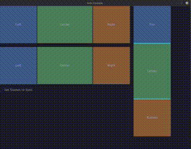

# iced_sash

A resizable panel widget for [iced](https://github.com/iced-rs/iced) that lets adjacent containers be dragged to resize.

Panels sizes are managed internally via iced tree state — no app-side size storage is required unless you want to link multiple sashes together.

<div align="center">
  
</div>

## Widgets

| Constructor | Panels | Drag handles |
|---|---|---|
| `SashH::new(...)` | Side by side (horizontal) | Vertical bars |
| `SashV::new(...)` | Stacked (vertical) | Horizontal bars |

Both return a `SashWidget` and share the same builder API.

## Basic usage

```rust
use iced_sash::SashH;

SashH::new(
    vec![left_panel, center_panel, right_panel],
    vec![200.0, 300.0, 200.0],  // initial widths
    400.0,                       // height
    4.0,                         // handle thickness
)
.min_size(50.0)
.into()
```

## Builder methods

| Method | Description |
|---|---|
| `.min_size(f32)` | Minimum panel size enforced while dragging. Default: `0.0`. |
| `.max_size(f32)` | Maximum total size; panels scale proportionally when exceeded. |
| `.id(Id)` | Override the auto-generated `Id`. Needed when routing resize messages to a specific sash. |
| `.on_resize(fn(Id, usize, f32) -> Message)` | Called on every drag tick with `(id, handle_index, new_size)`. |
| `.on_release(fn(Id, usize) -> Message)` | Called on mouse release with `(id, handle_index)`. |
| `.sync_sashes(Vec<f32>)` | Pushes external sizes into tree state each layout pass — use this to keep two sashes in sync. |
| `.style(fn(&Theme, Status) -> Style)` | Custom handle style. |
| `.outer_handle(f32)` | Adds a trailing-edge resize handle (right for `SashH`, bottom for `SashV`) of the given thickness. |
| `.outer_resize_mode(OuterResizeMode)` | Controls how panels are resized when the outer handle is dragged. Default: `LastOnly`. |
| `.on_outer_resize(fn(Id, f32) -> Message)` | Called on every outer-handle drag tick with `(id, new_total_main_size)`. |

## Outer handle

The outer handle lets users resize the entire widget from its trailing edge. Three distribution modes are available:

| `OuterResizeMode` | Behaviour |
|---|---|
| `LastOnly` | Only the last panel absorbs the change (default) |
| `Uniform` | Every panel grows or shrinks by the same amount |
| `Proportional` | Every panel scales proportionally to its current size |

```rust
SashH::new(children, sizes, 200.0, 4.0)
    .outer_handle(6.0)
    .outer_resize_mode(iced_sash::OuterResizeMode::Proportional)
    .on_outer_resize(Message::OuterResized)
```

To keep a linked sash in sync with outer-handle drags, call `iced_sash::apply_outer_resize` in your `update()` — the same pattern used for inner handles:

```rust
// In update():
Message::OuterResized(_id, new_total) => {
    iced_sash::apply_outer_resize(
        &mut self.sizes, new_total,
        OuterResizeMode::Proportional, 50.0,
    );
}

// In view():
SashH::new(children, self.sizes.clone(), 200.0, 4.0)
    .outer_handle(6.0)
    .outer_resize_mode(OuterResizeMode::Proportional)
    .on_outer_resize(Message::OuterResized)
    .sync_sashes(self.sizes.clone())
```

## Linking two sashes

Store the sizes in your app state and feed them back via `.sync_sashes()`:

```rust
// In update():
Message::Resized(_id, index, size) => {
    iced_sash::resize(&mut self.sizes, index, size, 50.0);
}

// In view():
SashH::new(children_a, self.sizes.clone(), 200.0, 4.0)
    .on_resize(Message::Resized)
    .sync_sashes(self.sizes.clone())

SashH::new(children_b, self.sizes.clone(), 200.0, 4.0)
    .on_resize(Message::Resized)
    .sync_sashes(self.sizes.clone())
```

## Styles

Three built-in style functions are provided:

| Function | Appearance |
|---|---|
| `iced_sash::subtle` | Background shades from the theme palette (default) |
| `iced_sash::primary` | Primary color from the theme palette |
| `iced_sash::transparent` | Transparent when idle, background shades on hover/drag |

Pass a custom function via `.style(...)` to fully control the handle appearance.

## Running the examples

```sh
cargo run --example sashing             # linked SashH + SashV with sync demo
cargo run --example sashing_w_outer     # outer handle with proportional resize mode
```

## Dependency

```toml
[dependencies]
iced_sash = { git = "https://github.com/charles-ray/iced_sash" }
```

## License

MIT
